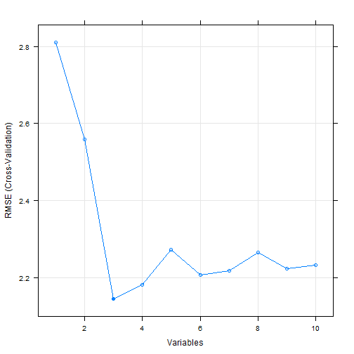

<!-- Limit image width and height -->
<style type='text/css'>
img {
    max-height: 560px;
    max-width: 964px;
}
</style>

<!-- Center image on slide -->
<script src="http://ajax.aspnetcdn.com/ajax/jQuery/jquery-1.7.min.js"></script>
<script type='text/javascript'>
$(function() {
    $("p:has(img)").addClass('centered');
});
</script>

## Objective


How many predictors must I use to get the outcome?

Use the [application](https://minimalia.shinyapps.io/featSelectionRFE/) to find out!


---

## Let's see how it works!

This app provides a user friendly interface in order to perform automatic feature selection from a set of observations (known features) using [Recursive Feature Elimination (RFE)](http://topepo.github.io/caret/rfe.html) in caret package and [mtcars](https://stat.ethz.ch/R-manual/R-devel/library/datasets/html/mtcars.html) data set.

As an example, let's see the features that must be selected to predict as most accurate as possible the Miles per US galloon using a Random Forest algorithm and 10-fold cross-validation for benchmarking!

Once the app runs, the features that have been selected are...:


```r
predictors(featSelect)
```

```
## [1] "disp" "hp"   "wt"
```

--- 

## Why?

Simply because the Root Mean Square Error (RMSE) is reduced by selecting just that features:



--- .class #id 

## Read more...

Read [Documentation](https://minimalia.shinyapps.io/featSelectionRFE/) for more information!


Enjoy!
