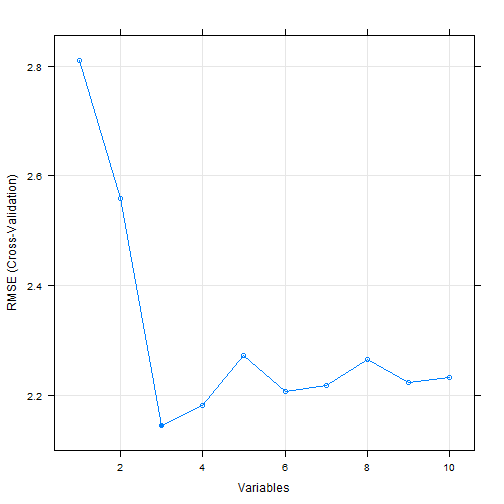

Feature selection using Recursive Feature Elimination
========================================================
author: MJ
date: 26 July 2016

Objective
========================================================

How many predictors must I use to get the outcome?

Use the [application](https://minimalia.shinyapps.io/featSelectionRFE/) to find out!


Let's see how it works!
========================================================

This app provides a user friendly interface in order to perform automatic feature selection from a set of observations (known features) using [Recursive Feature Elimination (RFE)](http://topepo.github.io/caret/rfe.html) in caret package and [mtcars](https://stat.ethz.ch/R-manual/R-devel/library/datasets/html/mtcars.html) data set.

As an example, let's see the features that must be selected to predict as most accurate as possible the Miles per US galloon using a Random Forest algorithm and 10-fold cross-validation for benchmarking!

Once the app runs, the features that have been selected are...:


```r
predictors(featSelect)
```

```
[1] "disp" "hp"   "wt"  
```


Why?
========================================================


Simply because the Root Mean Square Error (RMSE) is reduced by selecting just that features:



Read more...
========================================================

Read [Documentation](https://minimalia.shinyapps.io/featSelectionRFE/) for more information!


Enjoy!
